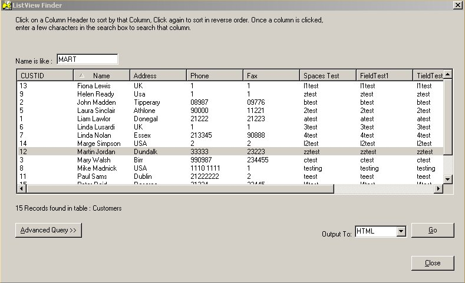



## Ultimate Listview

### Description

Listview1 will list all records from a given Data Source SQL qry. It sorts by Date, Number, text etc. It has a very nice find facility and a sql builder. Output data to CSV, XLS, Clipboard, HTML, PDF, Screen. (ActiveReports 2.0Pro) is needed
 
### More Info
 
FillListview (MyQuery, MyListview)

Please view the readme.wri file

The records in an underlying recordset qry

             |
---                |---
**Submitted On**   |2003-06-22 16:45:26
**By**             |[NULL](https://github.com/Planet-Source-Code/PSCIndex/blob/master/ByAuthor/empty.md)
**Level**          |Beginner
**User Rating**    |5.0 (35 globes from 7 users)
**Compatibility**  |VB 6\.0, VBA MS Access, VBA MS Excel
**Category**       |[Databases/ Data Access/ DAO/ ADO](https://github.com/Planet-Source-Code/PSCIndex/blob/master/ByCategory/databases-data-access-dao-ado__1-6.md)
**World**          |[Visual Basic](https://github.com/Planet-Source-Code/PSCIndex/blob/master/ByWorld/visual-basic.md)
**Archive File**   |[Ultimate\_L1604466222003\.zip](https://github.com/Planet-Source-Code/ultimate-listview__1-46364/archive/master.zip)

